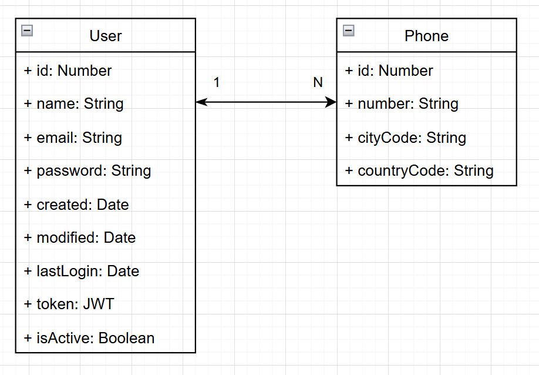
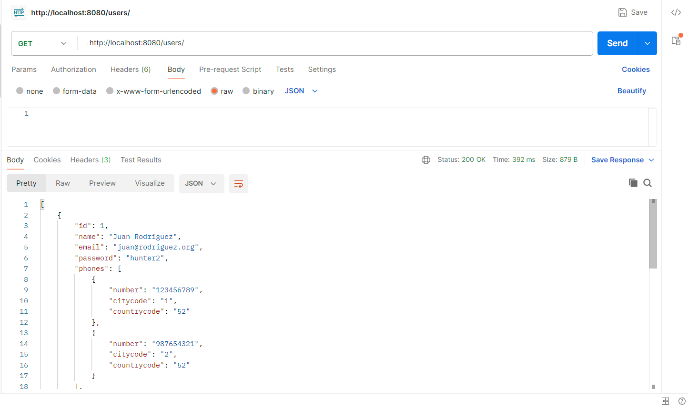
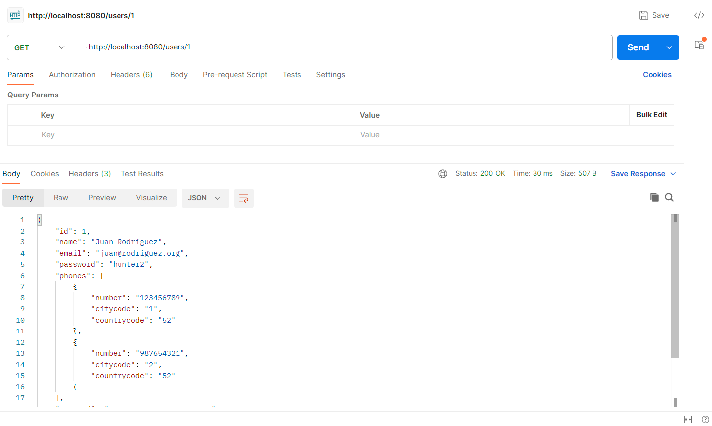
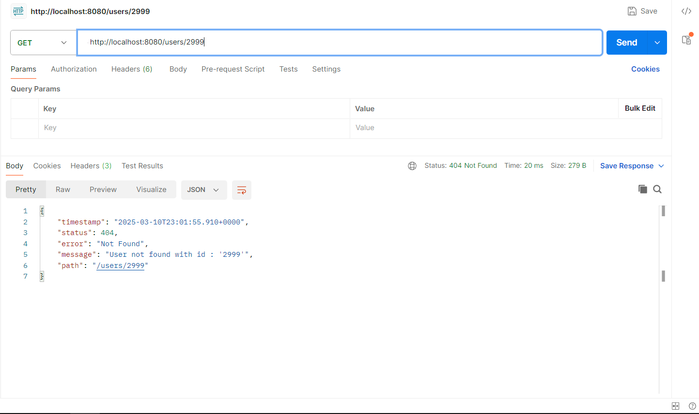
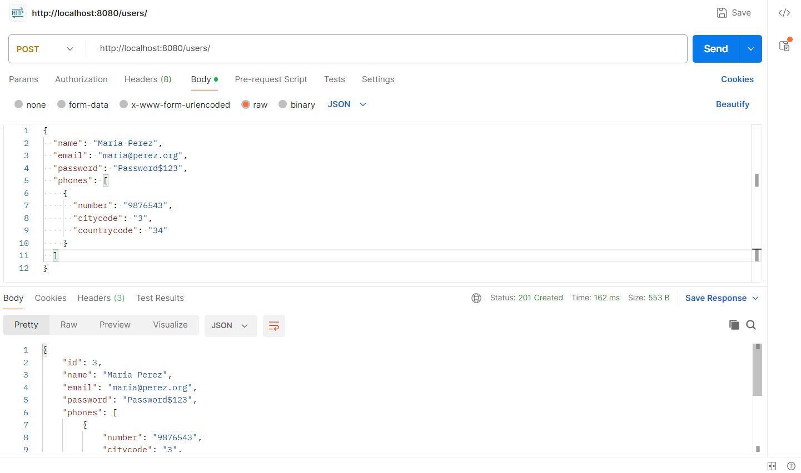
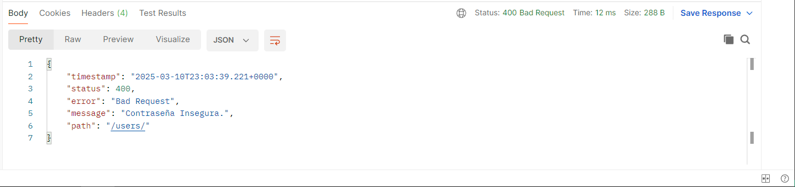
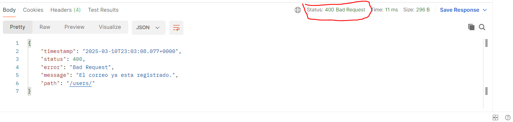
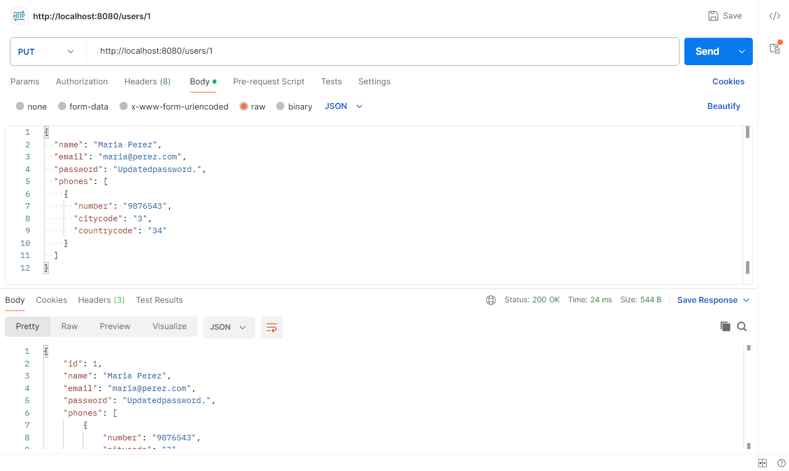
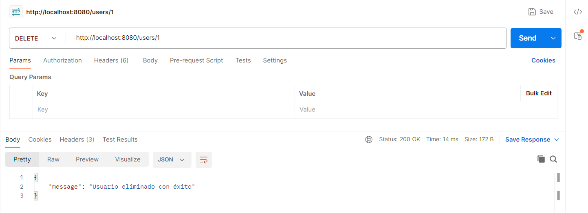

# API REST JAVA

### :building_construction: Tecnologías Implementadas

| **Tecnologías** | **Versión** | **Finalidad** |               
| ------------- | ------------- | ------------- |
| Java |  17.0.6 | JDK |
| Spring Boot |   2.1.3  | Framework |
| JSON Web Token | 0.11.5 | Creación de tokens de acceso | 
| Maven |  4.0.0 | Gestor de Proyectos |
| PostMan | 10.24.26 | Test de Apis |
| Git | 2.37.0  | Control de Versiones |


## Como probar en local

### 1️⃣ Clonar el Repositorio

```bash
git clone https://github.com/ivancastilloc/users-api-restful.git
cd .\users-api-restful\
```

### 2️⃣ Iniciar la aplicación

En este caso utilizamos maven con clear, para que elimine lo que esta en la memoria para evitare problemas.

```bash
mvn clean spring-boot:run
```


### 3️ Acceder a la API
La aplicación queda disponible en:

🔗 http://localhost:8080/

### Base de Datos H2
También se puede acceder a la consola de H2 a través de:

🔗 http://localhost:8080/h2-console

Usar las siguientes credenciales para conectarse:

```bash
JDBC URL: jdbc:h2:mem:testdb
Username: sa
Password: (leave blank)
```

## Modelo de la BD

El modelo de la base de datos consiste solo de usuarios y télefonos, donde la relación es que 1 usuario puede poseer muchos números de telefono.



### Utilización de la API

Para utilizar la API se deben utilizar herramientas como Postman.

## Endpoints Disponibles

| Método   | Endpoint              | Descripción                |
|----------|-----------------------|----------------------------|
| `GET`    | `http://localhost:8080/users/`       | Retorna todos los usuarios     |
| `GET`    | `http://localhost:8080/users/{id}`  | Retorna solo al usuario con el ID correspondiente |
| `POST`   | `http://localhost:8080/users/`       | Crea un nuevo usuario    |
| `PUT`    | `http://localhost:8080/users/{id}`  | Actualiza al usuario con el ID correspondiente   |
| `DELETE` | `http://localhost:8080/users/{id}`  | Elimina usuarios por ID    |

### Ejemplos de Endpoints siendo utilizados en PostMan y respuestas

## GET ALL



## GET BY ID - SUCCESS



## GET BY ID - 404



## POST - SUCCESS



## POST - INSECURE PASSWORD



## POST - MAIL ALREADY USED



## PUT - SUCCESS



## DELETE - SUCCESS



## DELETE - 404

